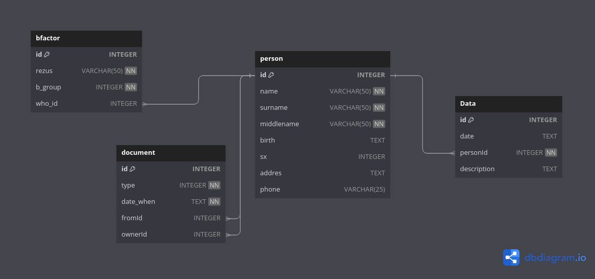

# QBooldStation
<p align="center" 
  style="background:blue;font-size:20px;">
<br>
<br>
  <a href="https://github.com/RichardLitt/standard-readme"></a>
  <a href="https://conventionalcommits.org"></a>
  <a href="http://commitizen.github.io/cz-cli/"></a>
</p>

# Hi guys there is a sample programm for reporting data organasation
# INSTALL GUIDE
```shell
   git clone repo
   mkdir build
   cd build
   cmake ..
```

[ERD_](https://dbdiagram.io/d/658c3b0b89dea627999ff7b6)


## Contributing

Anyone's participation is welcome! Open an [issue](https://github.com/GigaDevelopper/QBoolReporter/issues) or submit PRs.

## License

[MIT](LICENSE) © 2024 Azmiddin
